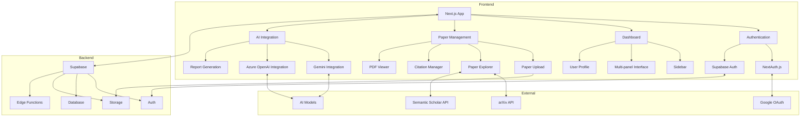
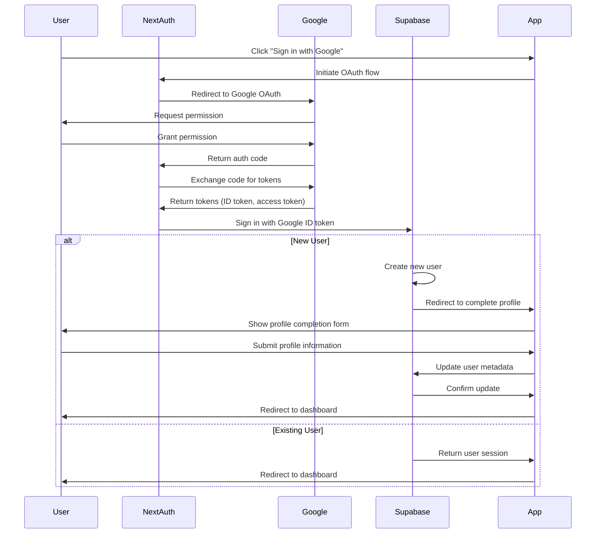

# Lesearch - Research Paper Accessibility Platform

Lesearch is a web application designed to enhance the readability and accessibility of research papers. It provides a comprehensive platform for researchers, students, and academics to read, annotate, and collaborate on research papers with AI-assisted features.

## Features

- **Authentication System**: Complete authentication flow with NextAuth.js and Supabase
- **Google Sign-in**: Seamless integration with Google OAuth
- **User Profiles**: Customizable user profiles with avatar uploads
- **Responsive Dashboard**: Modern UI with a responsive sidebar and drag-and-drop functionality
- **Multi-panel Interface**: Resizable panels for paper viewing, note-taking, and AI interaction
- **PDF Viewer**: Advanced PDF viewing capabilities with annotation support
- **BlockNote Editor**: Rich text editor with Markdown support for note-taking
- **AI Integration**: Chat with AI assistants using Google Gemini and Azure OpenAI
- **Paper Management**: Upload, organize, and explore research papers
- **Drag and Drop**: Intuitive drag-and-drop interface for sidebar items and paper organization

## Getting Started

### Prerequisites

- Node.js 20.x or later
- npm or yarn
- A Supabase account and project
- Google OAuth credentials
- Email service for password reset functionality

### Environment Variables

Before running the application, you need to set up your environment variables. Create a `.env.local` file in the root directory with the following variables:

```bash
NEXT_PUBLIC_APP_URL=http://localhost:3000
NEXTAUTH_URL=http://localhost:3000
NEXT_PUBLIC_SUPABASE_URL=your-supabase-url
NEXT_PUBLIC_SUPABASE_ANON_KEY=your-supabase-anon-key
NEXT_PUBLIC_SUPABASE_SERVICE_ROLE_KEY=your-supabase-service-role-key
GOOGLE_CLIENT_ID=your-google-client-id
GOOGLE_CLIENT_SECRET=your-google-client-secret
NEXTAUTH_SECRET=your-nextauth-secret
EMAIL_SERVER_HOST=smtp.example.com
EMAIL_SERVER_PORT=465
EMAIL_SERVER_USER=your-email@example.com
EMAIL_SERVER_PASSWORD=your-email-password
```

Team members can access the actual environment variables through our private Notion document.

### Installation

```bash
# Clone the repository
git clone https://github.com/LeSearch/frontend-v1.git
cd frontend-v1

# Install dependencies
npm install --legacy-peer-deps
# or
yarn install --legacy-peer-deps
```

### Running the Development Server

```bash
# Start the development server
npm run dev
# or
yarn dev
```

Open [http://localhost:3000](http://localhost:3000) with your browser to see the application.

### Building for Production

```bash
# Build the application
npm run build
# or
yarn build

# Start the production server
npm start
# or
yarn start
```

## Project Structure

```
frontend-v1/
├── .windsurf/            # AI development guidelines
├── ai_docs/              # Documentation for developers and AI assistants
├── public/               # Static assets
├── specs/                # Feature specifications and roadmap
├── src/                  # Source code
│   ├── app/              # Next.js App Router
│   │   ├── (auth)/       # Authentication pages
│   │   ├── (landing)/    # Landing pages
│   │   ├── (main)/       # Main application pages
│   │   └── api/          # API routes
│   ├── components/       # Reusable UI components
│   ├── hooks/            # Custom React hooks
│   ├── lib/              # Utility functions and libraries
│   └── store/            # State management with Zustand
└── ...
```

## Application Architecture



## Authentication Flow



## Documentation

The project includes comprehensive documentation in the following directories:

### `ai_docs/`

Contains detailed documentation about the codebase for developers and AI assistants:

- `architecture-overview.md` - Overall project structure and architecture
- `authentication-system.md` - Details about the authentication flow
- `ui-components.md` - Documentation of UI components and design patterns
- `state-management.md` - Information about state management with Zustand
- `environment-variables.md` - Guide to environment variables
- `pdf-viewer-system.md` - Documentation for the PDF viewer implementation
- `lesearch_architecture.md` - Detailed system architecture
- `lesearch_project_plan.md` - Project planning and roadmap

### `specs/`

Contains specifications for current and future features:

- `overview.md` - Project vision and core features
- `multi-panel-interface.md` - Specification for the resizable panel interface
- `paper-management.md` - Specification for paper upload and management
- `ai-integration.md` - Specification for AI assistant integration

### `.windsurf/`

Contains guidelines for AI development:

- `dependencies.md` - Guidelines for managing dependencies
- `coding-standards.md` - Coding standards and best practices
- `ai-development-prompts.md` - Standardized prompts for AI assistants

## Technologies

- **Frontend**: Next.js 15, React 19, Tailwind CSS 4
- **UI Components**: shadcn/ui with Radix UI primitives
- **State Management**: Zustand with persist middleware
- **Authentication**: NextAuth.js + Supabase
- **Database & Storage**: Supabase
- **Form Handling**: React Hook Form with Zod validation
- **PDF Viewer**: react-pdf with custom annotation support
- **Rich Text Editor**: BlockNote with Markdown support
- **Panel Management**: react-resizable-panels
- **Drag and Drop**: react-dnd for sidebar and paper organization

## Contributing

1. Fork the repository
2. Create your feature branch (`git checkout -b feature/amazing-feature`)
3. Commit your changes (`git commit -m 'Add some amazing feature'`)
4. Push to the branch (`git push origin feature/amazing-feature`)
5. Open a Pull Request

## License

This project is licensed under the MIT License - see the LICENSE file for details.