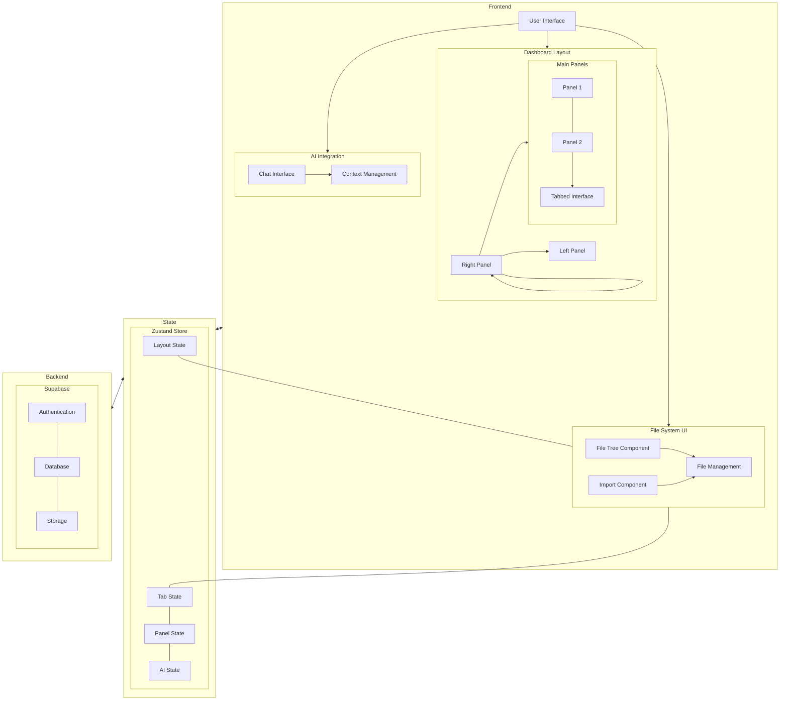
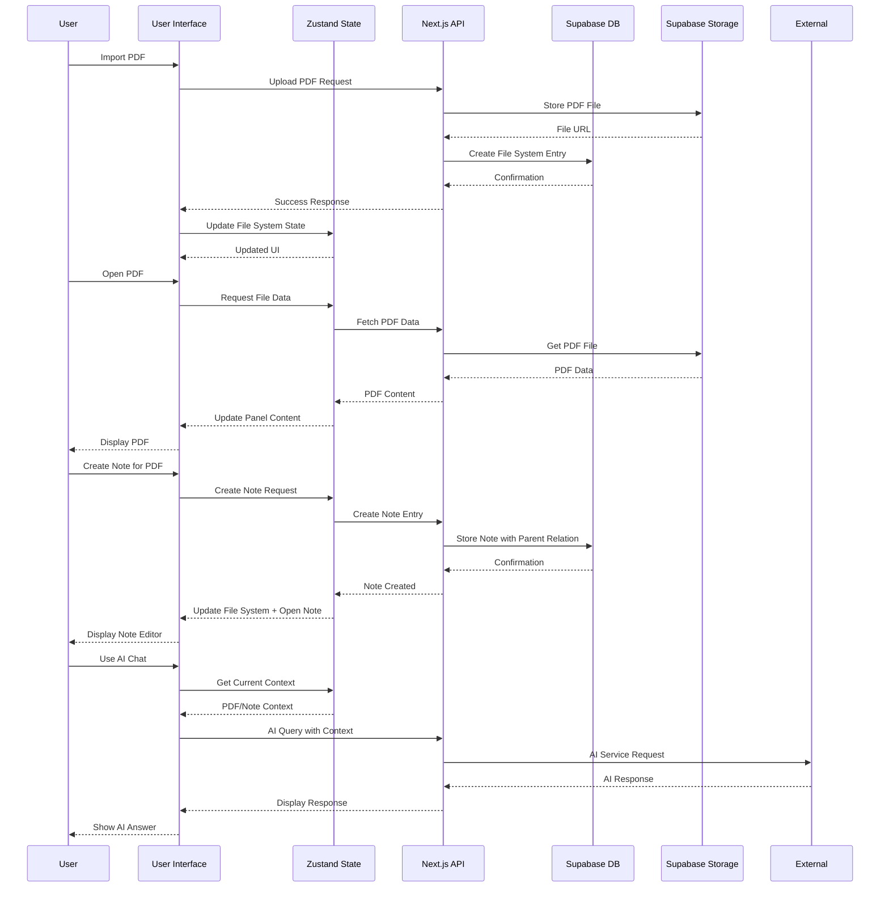
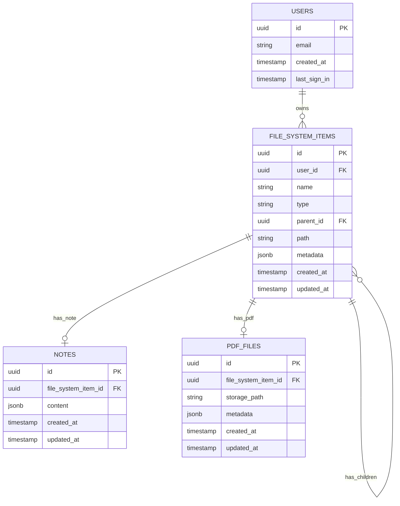
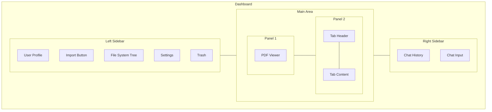
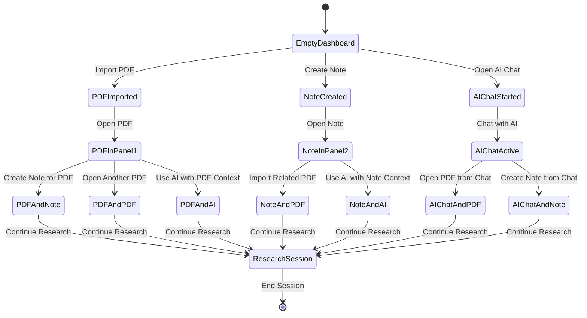
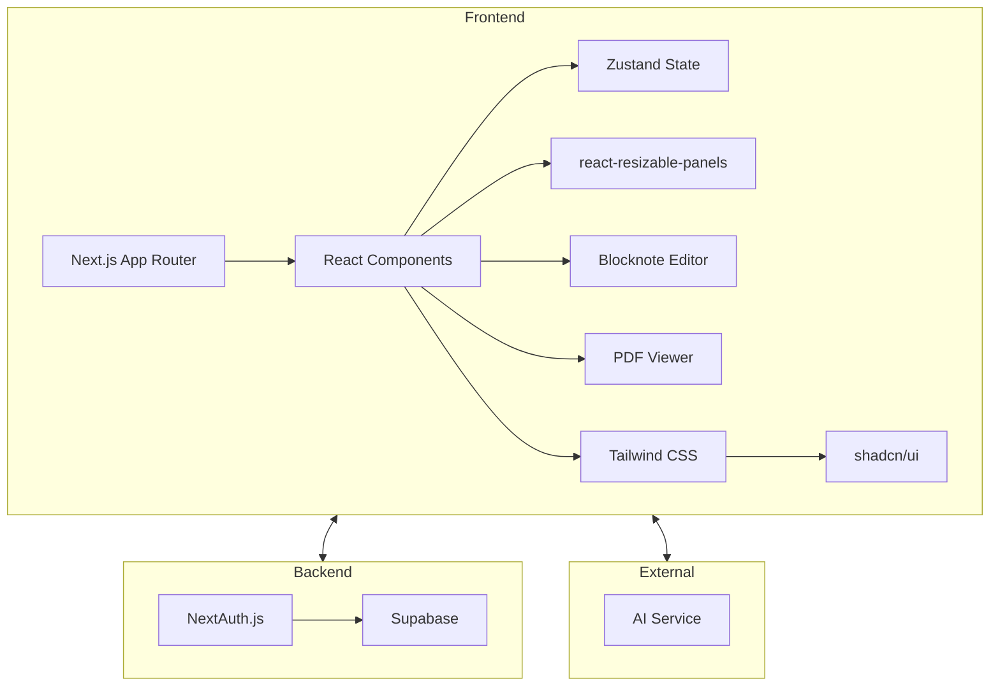

# Lesearch Architecture Details

This document provides additional architectural details and diagrams for the Lesearch application.

## Component Architecture

## Data Flow Diagram

## File System Data Model

## User Interface Layout

## Workflow State Transitions

## Technical Stack Integration

This document provides visual representations of the Lesearch application architecture to complement the project plan.
