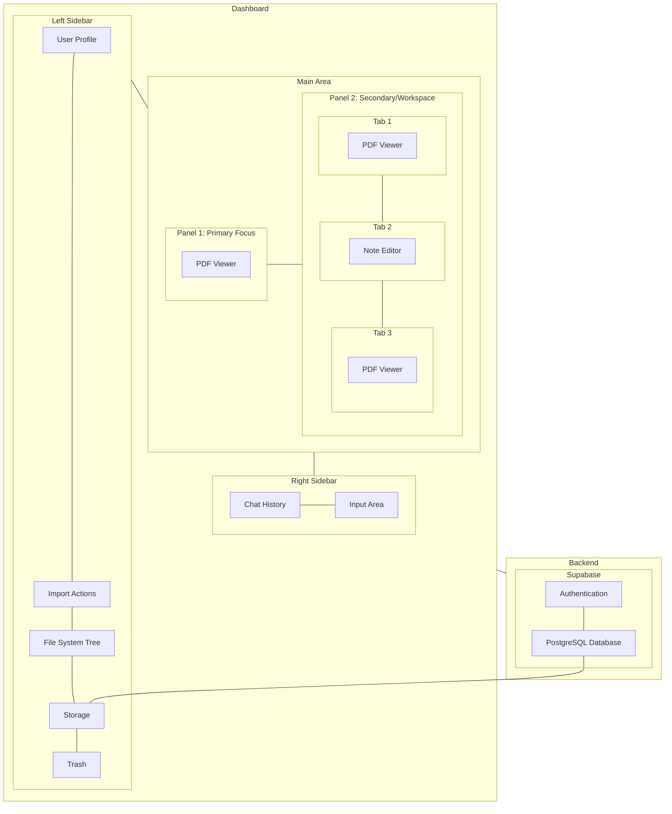
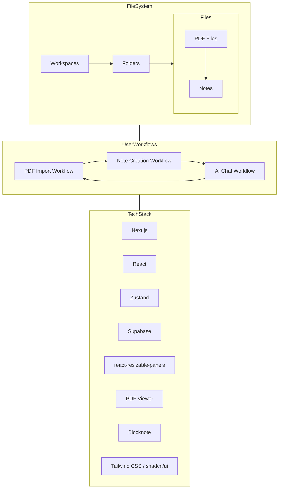

# Lesearch Application Description

## 1. Introduction
Lesearch is a web application designed to create a focused and efficient research environment. Its primary goal is to improve the readability and accessibility of research papers, facilitate deep interaction with content, and integrate AI assistance directly into the workflow. The application provides a flexible workspace for users to organize research assets, read documents, take notes, and leverage AI for understanding and analysis.

## 2. Core Concept: The Research Workspace
The core concept of Lesearch is a dynamic dashboard that adapts to the user's research process. Instead of static pages, the user interacts with a resizable, multi-panel layout where different tools and documents can be arranged side-by-side, allowing for seamless transitions between reading, writing, and AI interaction. The application manages a user's research assets (papers, notes, etc.) within a structured, hierarchical file system.

## 3. Dashboard Layout Architecture
The Lesearch dashboard features a three-column layout, built using resizable panels:

### Left Sidebar (Navigation & Organization):
- **Purpose**: Provides the primary navigation, file system browser, and application settings access.
- **Content**:
  - User Profile & Import Actions (at the top)
  - Hierarchical File System Tree: Displays Workspaces (Public/Private) containing Folders and Files. Different file types (PDF, Note) are visually distinct (e.g., by icons/logos). Files can represent parent-child relationships.
  - Settings & Trash (at the bottom)
- **Behavior**: Resizable and togglable (can be collapsed/expanded).

### Main Content Area (Panels 1 & 2):
- **Purpose**: The central workspace where research assets are viewed and edited. Divided into two resizable panels.
- **Panel 1**: Primary Focus Panel:
  - Typically used for the main research paper the user is currently focusing on.
  - Primarily renders the PDF Viewer component.
- **Panel 2**: Secondary / Workspace Panel:
  - A tabbed interface (similar to a code editor with multiple tabs).
  - Can hold multiple open documents or tools simultaneously.
  - Tabs can render different components:
    - PDF Viewer: For viewing citation papers, reference papers, or other related PDFs.
    - Note Editor (Blocknote): For creating and editing rich-text notes.
  - Users can switch between tabs to quickly access different related pieces of information or tasks.
- **Behavior**: Panel 1 and Panel 2 are horizontally resizable relative to each other within the Main Content Area. The entire Main Content Area is resizable relative to the sidebars.

### Right Sidebar (AI Chat):
- **Purpose**: Provides an integrated interface for interacting with AI models.
- **Content**: Chat history, input area for prompts.
- **Behavior**: Resizable and togglable (can be collapsed/expanded). It is designed to be context-aware, meaning the AI can understand and discuss the content currently displayed in Panel 1.

## 4. Key Features
- **Hierarchical File System**: Organize research papers, notes, and other related files into Workspaces and Folders within the application. Supports parent-child relationships between files (e.g., a Note created about a PDF is a child of that PDF in the file system).
- **PDF Management & Viewing**: Import PDFs, view them in a dedicated viewer with features like thumbnails, zoom, and search.
- **Multi-Panel Layout**: View multiple documents or tools side-by-side for comparison and integrated workflows.
- **Tabbed Interface (Panel 2)**: Manage multiple open secondary documents (PDFs, Notes) efficiently within a single panel using tabs.
- **Integrated Note Taking**: Create and edit rich-text notes using a Blocknote editor, often alongside a PDF.
- **AI Assistance**: Access an AI chat interface directly in the workspace, capable of understanding the document currently open in Panel 1 to provide summaries, explanations, or answer questions.
- **Persistent Layout**: The sizes and visibility of panels and sidebars are saved and restored across sessions.
- **Supabase Integration**: Secure authentication, database storage for file system structure and metadata, and object storage for PDF files.

## 5. File System / Workspace Model Details
The user's research library is managed as a tree structure stored in the database:

- **Workspaces**: Top-level containers (e.g., "Private Research", "Public").
- **Folders**: Can exist within Workspaces or other Folders, used for grouping related items.
- **Files**: The actual research assets. Key types are:
  - **PDF**: Represents an imported research paper or document. Stored securely in Supabase Storage.
  - **Note**: Represents text notes, potentially created in markdown or rich-text format (Blocknote JSON). Stored in the database or associated storage.
- **Parent-Child Relationships**: The file system supports items having a designated parent. This is crucial for linking related assets in the workflow (e.g., a Note or a Citation PDF can be a child of the main PDF it relates to). The sidebar visualizes this hierarchy and the file type (using distinct logos/icons).

## 6. Enhanced User Workflows
Users can initiate their research process from different starting points. The application's logic for opening files adapts based on the file type and the current state of the panels:

### Case 1: Starting with Importing a PDF
1. User clicks the "Import" icon in the Left Sidebar.
2. User uploads a PDF file.
3. The PDF is stored securely, and a corresponding "File" entry (Type: PDF) is created in the database under the user's selected/default workspace and folder (e.g., "Private Workspaces" -> "PDFs").
4. The Left Sidebar tree view updates to show the new PDF file.
5. User clicks the newly imported PDF file in the Left Sidebar.
6. Action: The PDF is opened in Panel 1 (the Primary Focus Panel).
7. The dashboard layout shows: Left Sidebar | Panel 1 (PDF Viewer) | Right Sidebar (AI Chat - potentially collapsed).

**Subsequent Actions**:
- If the user clicks another PDF in the sidebar (e.g., a reference paper): Action: It opens as a new tab in Panel 2.
- If the user clicks an action to "Create Notes for this PDF" (e.g., a button in Panel 1 header): Action: A new "File" entry (Type: Note) is created in the database, linked as a child of the PDF in Panel 1. This Note file is then opened as a new tab in Panel 2, rendering the Blocknote Editor.
- If the user clicks a linked citation within the PDF in Panel 1 (assuming citation parsing/linking is implemented and the citation PDF is in their library): Action: The corresponding citation PDF is opened as a new tab in Panel 2.
- If the user uses the Right Sidebar AI Chat: Action: The AI chat is contextualized by the PDF in Panel 1. AI output could potentially be saved as a new Note child of the PDF.

### Case 2: Starting with Notes
1. User clicks an action to "Create New Note" (e.g., in the Left Sidebar "+").
2. A new "File" entry (Type: Note) is created in the database under the selected/default folder.
3. The Left Sidebar tree view updates.
4. User clicks the new Note file in the Left Sidebar.
5. Action: The Note file is opened as a new tab in Panel 2, rendering the Blocknote Editor. Panel 1 remains empty or shows previous content.
6. The dashboard layout shows: Left Sidebar | Panel 1 (Empty/Other Content) | Panel 2 (Note Editor Tab) | Right Sidebar (AI Chat).

**Subsequent Actions**:
- If the user imports a PDF while focused on this Note (e.g., a paper related to the note's topic): Action: The PDF is opened in Panel 1, and is linked as a child of the original Note file in the database.
- If the user clicks another Note or PDF in the sidebar: Action: Follows the standard openFile rules (PDF to Panel 1 if empty, else Panel 2 tab; Note to Panel 2 tab). If a new PDF opens in Panel 1, the AI context switches.
- If the user uses the Right Sidebar AI Chat: Action: AI context might default to the active Note tab in Panel 2, or prompt the user if context is ambiguous.

### Case 3: Starting with AI Chat
1. User opens the Right Sidebar (if closed).
2. User begins interacting with the AI.
3. The AI Chat operates without document context initially.

**Subsequent Actions**: The AI interaction is expected to lead to the user needing a document or notes:
- If the AI suggests a paper or the user decides to work on one mentioned in the chat: User initiates the Import PDF workflow (Case 1), which then opens the PDF in Panel 1 and continues that workflow.
- If the user decides to start writing down thoughts from the AI chat: User initiates the Create Note workflow (Case 2), which opens the Note in Panel 2 and continues that workflow.
- If a PDF is later opened in Panel 1 (either via Import or clicking an existing one), the AI Chat becomes context-aware of that PDF.

## 7. Technical Foundation (Overview)
The architecture relies on the specified tech stack:

- **Next.js (App Router)**: Provides the routing and server-side capabilities for the application structure and API routes.
- **React**: Used for building the component-based user interface.
- **Zustand**: Manages complex client-side state for the dashboard layout, panel contents, tab management, and file system representation (synced with DB). Persistence middleware saves layout and open state across sessions (but not file content).
- **Supabase**: Provides the backend-as-a-service, including:
  - Authentication (with NextAuth.js for providers).
  - PostgreSQL Database: Stores the hierarchical file_system_items data and user metadata.
  - Supabase Storage: Stores the actual PDF files.
  - Row Level Security (RLS): Ensures data access control.
- **react-resizable-panels**: Enables the flexible and persistent multi-panel layout.
- **PDF Viewer Library (@anaralabs/lector)**: Renders PDF documents.
- **Blocknote**: Provides the rich-text editor component for notes.
- **Tailwind CSS / shadcn/ui**: For styling and pre-built UI components.

The system fetches file system structure from the database on load and whenever changes occur (import, create, delete). File content (PDF data, Note JSON) is fetched on demand when a file is opened in a panel or tab.

## Application Architecture Diagram

This document outlines the structure and intended behavior of the Lesearch application with the enhanced dashboard layout and workflows. You can use this as a reference point for development planning and further discussions.
