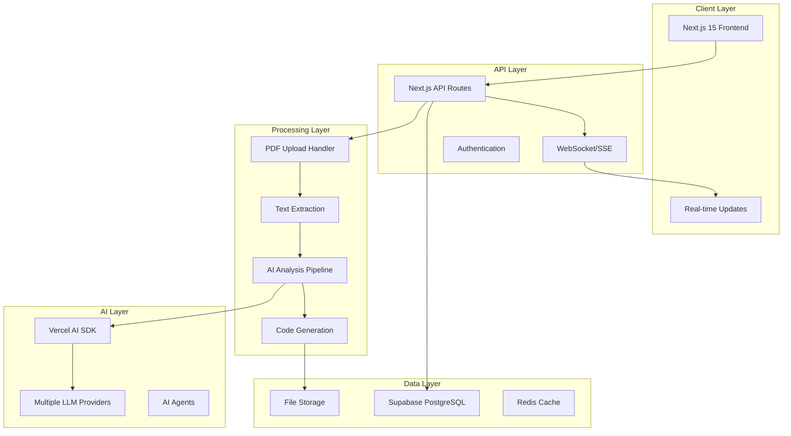

# Design Document

## Overview

LeCodeR MVP is a TypeScript-based web application that transforms academic research papers into executable code repositories. The system leverages Next.js 15 with the app router, Vercel AI SDK for LLM interactions, and Supabase for data persistence. The architecture follows a modern, serverless approach with real-time capabilities and focuses on maintainable, well-documented code.

The design improves upon the HKU project structure by implementing it in TypeScript with better error handling, real-time progress tracking, and a more robust pipeline architecture using the Vercel AI SDK's agentic capabilities.

## Architecture

### High-Level Architecture



### Technology Stack

- **Frontend**: Next.js 15 (App Router), React 19, TypeScript, Tailwind CSS
- **Backend**: Next.js API Routes, Vercel Edge Functions
- **AI/LLM**: Vercel AI SDK, OpenAI GPT-4/5, Google Gemini, Claude
- **Database**: Supabase (PostgreSQL) with real-time subscriptions
- **File Storage**: Supabase Storage or Vercel Blob
- **Deployment**: Vercel (Frontend + API), Supabase (Database)
- **Real-time**: Server-Sent Events (SSE) or Supabase real-time

## Components and Interfaces

### Frontend Components

#### Core UI Components
```typescript
// components/ui/upload-zone.tsx
interface UploadZoneProps {
  onFileUpload: (file: File) => Promise<void>;
  isUploading: boolean;
  acceptedTypes: string[];
  maxSize: number;
}

// components/ui/progress-tracker.tsx
interface ProgressTrackerProps {
  stages: PipelineStage[];
  currentStage: number;
  error?: string;
}

// components/ui/project-card.tsx
interface ProjectCardProps {
  project: Project;
  onDownload: (projectId: string) => void;
  onDelete: (projectId: string) => void;
}
```

#### Layout Components
```typescript
// components/layout/dashboard-layout.tsx
interface DashboardLayoutProps {
  children: React.ReactNode;
  user?: User;
}

// components/layout/navigation.tsx
interface NavigationProps {
  currentPath: string;
  user?: User;
}
```

### Backend API Interfaces

#### API Route Handlers
```typescript
// app/api/upload/route.ts
interface UploadRequest {
  file: File;
  userId?: string;
}

interface UploadResponse {
  projectId: string;
  status: 'uploaded' | 'processing' | 'completed' | 'error';
  message: string;
}

// app/api/projects/[id]/route.ts
interface ProjectResponse {
  id: string;
  title: string;
  status: ProjectStatus;
  createdAt: string;
  updatedAt: string;
  stages: PipelineStage[];
  downloadUrl?: string;
}
```

#### AI Pipeline Interfaces
```typescript
// lib/ai/pipeline.ts
interface PipelineStage {
  id: number;
  name: string;
  status: 'pending' | 'processing' | 'completed' | 'error';
  result?: any;
  error?: string;
  startTime?: Date;
  endTime?: Date;
}

interface PipelineContext {
  projectId: string;
  paperContent: string;
  stages: PipelineStage[];
  metadata: PaperMetadata;
}
```

### AI Agent Architecture

#### Core AI Agents
```typescript
// lib/ai/agents/concept-extractor.ts
interface ConceptExtractorAgent {
  extractConcepts(paperContent: string): Promise<ResearchConcepts>;
}

// lib/ai/agents/algorithm-analyzer.ts
interface AlgorithmAnalyzerAgent {
  analyzeAlgorithms(concepts: ResearchConcepts): Promise<AlgorithmSpecs>;
}

// lib/ai/agents/code-generator.ts
interface CodeGeneratorAgent {
  generateCode(
    algorithms: AlgorithmSpecs,
    architecture: SystemArchitecture
  ): Promise<GeneratedCodebase>;
}
```

## Data Models

### Database Schema

#### Projects Table
```sql
CREATE TABLE projects (
  id UUID PRIMARY KEY DEFAULT gen_random_uuid(),
  user_id UUID REFERENCES auth.users(id),
  title VARCHAR(255) NOT NULL,
  paper_content TEXT NOT NULL,
  status project_status NOT NULL DEFAULT 'uploaded',
  current_stage INTEGER DEFAULT 0,
  metadata JSONB,
  created_at TIMESTAMP WITH TIME ZONE DEFAULT NOW(),
  updated_at TIMESTAMP WITH TIME ZONE DEFAULT NOW()
);

CREATE TYPE project_status AS ENUM (
  'uploaded',
  'processing',
  'completed',
  'error',
  'cancelled'
);
```

#### Pipeline Stages Table
```sql
CREATE TABLE pipeline_stages (
  id UUID PRIMARY KEY DEFAULT gen_random_uuid(),
  project_id UUID REFERENCES projects(id) ON DELETE CASCADE,
  stage_number INTEGER NOT NULL,
  stage_name VARCHAR(100) NOT NULL,
  status stage_status NOT NULL DEFAULT 'pending',
  input_data JSONB,
  output_data JSONB,
  error_message TEXT,
  started_at TIMESTAMP WITH TIME ZONE,
  completed_at TIMESTAMP WITH TIME ZONE,
  created_at TIMESTAMP WITH TIME ZONE DEFAULT NOW()
);

CREATE TYPE stage_status AS ENUM (
  'pending',
  'processing',
  'completed',
  'error',
  'retrying'
);
```

#### Generated Files Table
```sql
CREATE TABLE generated_files (
  id UUID PRIMARY KEY DEFAULT gen_random_uuid(),
  project_id UUID REFERENCES projects(id) ON DELETE CASCADE,
  file_path VARCHAR(500) NOT NULL,
  file_content TEXT NOT NULL,
  file_type VARCHAR(50) NOT NULL,
  created_at TIMESTAMP WITH TIME ZONE DEFAULT NOW()
);
```

### TypeScript Data Models

```typescript
// types/project.ts
interface Project {
  id: string;
  userId?: string;
  title: string;
  paperContent: string;
  status: ProjectStatus;
  currentStage: number;
  metadata: PaperMetadata;
  stages: PipelineStage[];
  createdAt: string;
  updatedAt: string;
}

interface PaperMetadata {
  fileName: string;
  fileSize: number;
  pageCount: number;
  authors?: string[];
  abstract?: string;
  keywords?: string[];
}

// types/ai.ts
interface ResearchConcepts {
  mainObjective: string;
  keyMethods: string[];
  algorithms: string[];
  datasets: string[];
  evaluationMetrics: string[];
}

interface AlgorithmSpecs {
  algorithms: Algorithm[];
  dependencies: string[];
  systemRequirements: SystemRequirements;
}

interface GeneratedCodebase {
  files: GeneratedFile[];
  structure: ProjectStructure;
  documentation: Documentation;
}
```

## Error Handling

### Error Classification
```typescript
// lib/errors/error-types.ts
enum ErrorType {
  UPLOAD_ERROR = 'UPLOAD_ERROR',
  PROCESSING_ERROR = 'PROCESSING_ERROR',
  AI_ERROR = 'AI_ERROR',
  DATABASE_ERROR = 'DATABASE_ERROR',
  RATE_LIMIT_ERROR = 'RATE_LIMIT_ERROR',
  VALIDATION_ERROR = 'VALIDATION_ERROR'
}

interface AppError {
  type: ErrorType;
  message: string;
  code: string;
  details?: any;
  retryable: boolean;
}
```

### Error Handling Strategy
1. **Client-Side**: React Error Boundaries with user-friendly messages
2. **API Routes**: Structured error responses with proper HTTP status codes
3. **AI Pipeline**: Retry logic with exponential backoff for transient failures
4. **Database**: Connection pooling and transaction rollback on failures
5. **File Operations**: Cleanup of partial uploads on errors

### Retry Logic
```typescript
// lib/utils/retry.ts
interface RetryConfig {
  maxAttempts: number;
  baseDelay: number;
  maxDelay: number;
  backoffFactor: number;
}

async function withRetry<T>(
  operation: () => Promise<T>,
  config: RetryConfig
): Promise<T> {
  // Exponential backoff implementation
}
```

## Testing Strategy

### Testing Pyramid

#### Unit Tests (70%)
- **Components**: React Testing Library + Jest
- **Utilities**: Jest for pure functions
- **AI Agents**: Mock LLM responses for deterministic testing
- **Database**: Supabase local testing with test fixtures

#### Integration Tests (20%)
- **API Routes**: Supertest for endpoint testing
- **AI Pipeline**: End-to-end pipeline testing with sample papers
- **Database Operations**: Real database operations with test data

#### E2E Tests (10%)
- **User Flows**: Playwright for critical user journeys
- **File Upload**: Complete upload-to-download flow testing
- **Error Scenarios**: Network failures, invalid files, etc.

### Test Structure
```typescript
// __tests__/components/upload-zone.test.tsx
describe('UploadZone Component', () => {
  it('should accept valid PDF files', async () => {
    // Test implementation
  });
  
  it('should reject invalid file types', async () => {
    // Test implementation
  });
});

// __tests__/api/upload.test.ts
describe('/api/upload', () => {
  it('should process valid PDF upload', async () => {
    // Test implementation
  });
});
```

### AI Testing Strategy
```typescript
// __tests__/ai/pipeline.test.ts
describe('AI Pipeline', () => {
  beforeEach(() => {
    // Mock Vercel AI SDK responses
    mockAISDK.mockImplementation(() => ({
      generateText: jest.fn().mockResolvedValue(mockResponse)
    }));
  });
  
  it('should extract concepts from research paper', async () => {
    // Test with sample paper content
  });
});
```

## Performance Considerations

### Frontend Optimization
- **Code Splitting**: Dynamic imports for heavy components
- **Image Optimization**: Next.js Image component with proper sizing
- **Bundle Analysis**: Regular bundle size monitoring
- **Caching**: Aggressive caching of static assets

### Backend Optimization
- **Edge Functions**: Use Vercel Edge Runtime for faster cold starts
- **Database Indexing**: Proper indexes on frequently queried columns
- **Connection Pooling**: Supabase connection pooling configuration
- **Caching Strategy**: Redis for frequently accessed data

### AI Pipeline Optimization
- **Streaming**: Stream AI responses for better UX
- **Parallel Processing**: Run independent stages concurrently
- **Model Selection**: Choose appropriate models for each task
- **Token Management**: Optimize prompts to reduce token usage

## Security Measures

### Authentication & Authorization
```typescript
// lib/auth/middleware.ts
interface AuthContext {
  user?: User;
  session?: Session;
}

async function requireAuth(request: Request): Promise<AuthContext> {
  // Supabase auth validation
}
```

### Data Protection
- **Input Validation**: Zod schemas for all API inputs
- **File Sanitization**: PDF content sanitization before processing
- **Rate Limiting**: Per-user and per-IP rate limiting
- **CORS Configuration**: Strict CORS policies for API routes

### Privacy Controls
- **Data Retention**: Configurable data retention policies
- **User Consent**: Clear consent for AI processing
- **Data Deletion**: Complete data removal on user request
- **Audit Logging**: Track all data access and modifications